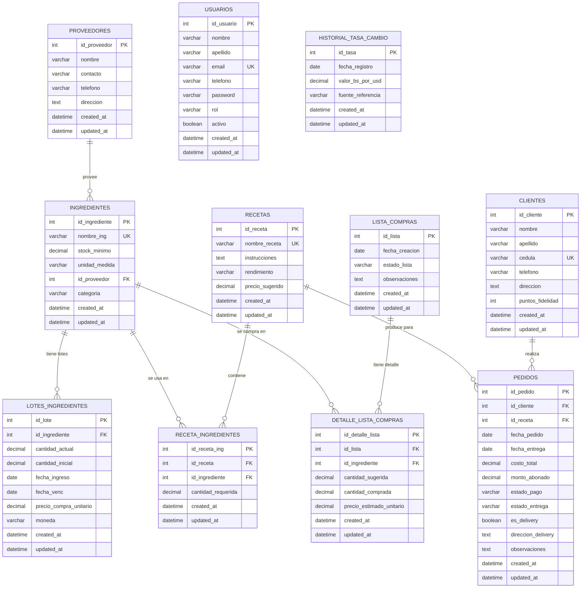

# Diagrama Entidad-Relacion - PanQueo / SaborControl

---

## Detalle de Columnas: Tipos, ENUMs y Restricciones

### PROVEEDORES
| Columna | Tipo | Restricciones |
|---------|------|---------------|
| id_proveedor | INTEGER | PK, AUTO_INCREMENT |
| nombre | VARCHAR(255) | NOT NULL |
| contacto | VARCHAR(255) | NULL |
| telefono | VARCHAR(255) | NULL |
| direccion | TEXT | NULL |
| created_at | TIMESTAMP | NOT NULL, DEFAULT NOW |
| updated_at | TIMESTAMP | NOT NULL, DEFAULT NOW |

### INGREDIENTES
| Columna | Tipo | Restricciones |
|---------|------|---------------|
| id_ingrediente | INTEGER | PK, AUTO_INCREMENT |
| nombre_ing | VARCHAR(255) | UNIQUE, NOT NULL |
| stock_minimo | DECIMAL(10,2) | NOT NULL, DEFAULT 0 |
| unidad_medida | VARCHAR(255) | NOT NULL |
| id_proveedor | INTEGER | FK -> PROVEEDORES (SET NULL) |
| categoria | VARCHAR(255) | NULL |
| created_at | TIMESTAMP | NOT NULL |
| updated_at | TIMESTAMP | NOT NULL |

### LOTES_INGREDIENTES
| Columna | Tipo | Restricciones |
|---------|------|---------------|
| id_lote | INTEGER | PK, AUTO_INCREMENT |
| id_ingrediente | INTEGER | FK -> INGREDIENTES (CASCADE), NOT NULL |
| cantidad_actual | DECIMAL(10,2) | NOT NULL, CHECK >= 0 |
| cantidad_inicial | DECIMAL(10,2) | NOT NULL |
| fecha_ingreso | DATE | NOT NULL |
| fecha_venc | DATE | NOT NULL, CHECK > fecha_ingreso |
| precio_compra_unitario | DECIMAL(10,2) | NULL |
| moneda | VARCHAR(3) | NOT NULL, DEFAULT 'Bs' |
| created_at | TIMESTAMP | NOT NULL |
| updated_at | TIMESTAMP | NOT NULL |

### RECETAS
| Columna | Tipo | Restricciones |
|---------|------|---------------|
| id_receta | INTEGER | PK, AUTO_INCREMENT |
| nombre_receta | VARCHAR(255) | UNIQUE, NOT NULL |
| instrucciones | TEXT | NULL |
| rendimiento | VARCHAR(255) | NULL |
| precio_sugerido | DECIMAL(10,2) | NULL |
| created_at | TIMESTAMP | NOT NULL |
| updated_at | TIMESTAMP | NOT NULL |

### RECETA_INGREDIENTES
| Columna | Tipo | Restricciones |
|---------|------|---------------|
| id_receta_ing | INTEGER | PK, AUTO_INCREMENT |
| id_receta | INTEGER | FK -> RECETAS (CASCADE), NOT NULL |
| id_ingrediente | INTEGER | FK -> INGREDIENTES (RESTRICT), NOT NULL |
| cantidad_requerida | DECIMAL(10,2) | NOT NULL, CHECK >= 0 |
| created_at | TIMESTAMP | NOT NULL |
| updated_at | TIMESTAMP | NOT NULL |

Indice unico compuesto: (id_receta, id_ingrediente)

### CLIENTES
| Columna | Tipo | Restricciones |
|---------|------|---------------|
| id_cliente | INTEGER | PK, AUTO_INCREMENT |
| nombre | VARCHAR(255) | NOT NULL |
| apellido | VARCHAR(255) | NOT NULL |
| cedula | VARCHAR(255) | UNIQUE, NOT NULL |
| telefono | VARCHAR(255) | NOT NULL |
| direccion | TEXT | NULL |
| puntos_fidelidad | INTEGER | NOT NULL, DEFAULT 0 |
| created_at | TIMESTAMP | NOT NULL |
| updated_at | TIMESTAMP | NOT NULL |

### PEDIDOS
| Columna | Tipo | Restricciones |
|---------|------|---------------|
| id_pedido | INTEGER | PK, AUTO_INCREMENT |
| id_cliente | INTEGER | FK -> CLIENTES (RESTRICT), NOT NULL |
| id_receta | INTEGER | FK -> RECETAS (SET NULL) |
| fecha_pedido | DATE | NOT NULL, DEFAULT CURRENT_DATE |
| fecha_entrega | DATE | NOT NULL |
| costo_total | DECIMAL(10,2) | NOT NULL |
| monto_abonado | DECIMAL(10,2) | NOT NULL, DEFAULT 0 |
| estado_pago | ENUM('Pendiente','Abonado','Pagado') | NOT NULL, DEFAULT 'Pendiente' |
| estado_entrega | ENUM('Por Preparar','En Cocina','Listo','Entregado') | NOT NULL, DEFAULT 'Por Preparar' |
| es_delivery | BOOLEAN | NOT NULL, DEFAULT FALSE |
| direccion_delivery | TEXT | NULL |
| observaciones | TEXT | NULL |
| created_at | TIMESTAMP | NOT NULL |
| updated_at | TIMESTAMP | NOT NULL |

### USUARIOS
| Columna | Tipo | Restricciones |
|---------|------|---------------|
| id_usuario | INTEGER | PK, AUTO_INCREMENT |
| nombre | VARCHAR(255) | NOT NULL |
| apellido | VARCHAR(255) | NOT NULL |
| email | VARCHAR(255) | UNIQUE, NOT NULL |
| telefono | VARCHAR(255) | NOT NULL |
| password | VARCHAR(255) | NOT NULL |
| rol | ENUM('admin','cocinero','vendedor') | NOT NULL, DEFAULT 'admin' |
| activo | BOOLEAN | NOT NULL, DEFAULT TRUE |
| created_at | TIMESTAMP | NOT NULL |
| updated_at | TIMESTAMP | NOT NULL |

### LISTA_COMPRAS
| Columna | Tipo | Restricciones |
|---------|------|---------------|
| id_lista | INTEGER | PK, AUTO_INCREMENT |
| fecha_creacion | DATE | NOT NULL, DEFAULT CURRENT_DATE |
| estado_lista | ENUM('Borrador','En Progreso','Completada') | NOT NULL, DEFAULT 'Borrador' |
| observaciones | TEXT | NULL |
| created_at | TIMESTAMP | NOT NULL |
| updated_at | TIMESTAMP | NOT NULL |

### DETALLE_LISTA_COMPRAS
| Columna | Tipo | Restricciones |
|---------|------|---------------|
| id_detalle_lista | INTEGER | PK, AUTO_INCREMENT |
| id_lista | INTEGER | FK -> LISTA_COMPRAS (CASCADE), NOT NULL |
| id_ingrediente | INTEGER | FK -> INGREDIENTES (RESTRICT), NOT NULL |
| cantidad_sugerida | DECIMAL(10,2) | NOT NULL |
| cantidad_comprada | DECIMAL(10,2) | NOT NULL, DEFAULT 0 |
| precio_estimado_unitario | DECIMAL(10,2) | NULL |
| created_at | TIMESTAMP | NOT NULL |
| updated_at | TIMESTAMP | NOT NULL |

### HISTORIAL_TASA_CAMBIO
| Columna | Tipo | Restricciones |
|---------|------|---------------|
| id_tasa | INTEGER | PK, AUTO_INCREMENT |
| fecha_registro | DATE | NOT NULL, DEFAULT CURRENT_DATE |
| valor_bs_por_usd | DECIMAL(10,4) | NOT NULL |
| fuente_referencia | VARCHAR(255) | NULL |
| created_at | TIMESTAMP | NOT NULL |
| updated_at | TIMESTAMP | NOT NULL |

---

## Reglas de Negocio

1. **FIFO**: Consumo de lotes ordenado por `fecha_venc ASC`
2. **Transaccionalidad**: Descuento atomico - si falta stock, rollback total
3. **Stock no negativo**: `cantidad_actual` siempre >= 0
4. **Fecha valida**: `fecha_venc` debe ser posterior a `fecha_ingreso`
5. **Anomalias > 20%**: Alerta si consumo real excede receta en mas de 20%
6. **Calculo dual Bs/USD**: Usa `historial_tasa_cambio` para conversion
